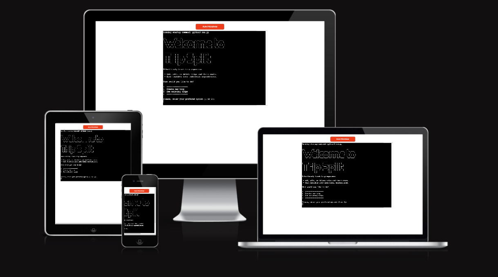
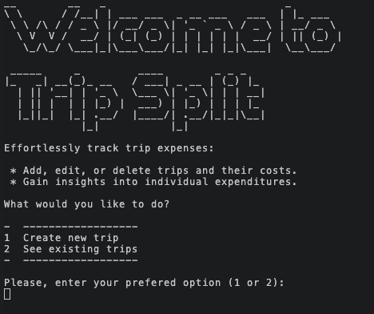

# Trip Split

Trip Split is an application to track trip expenses.

It enables users to seamlessly add, edit, or remove trips and their costs. Additionally, they can gain valuable insights into individual expenditures.

[View the live site here](https://trip-split-b5b1f0cae200.herokuapp.com/)

## Table of Contents

* [User Goals](#user-goals)
* [Design](#design)
* [Features](#features)
* [Technologies Used](#technologies-used)
* [Testing](#testing)
* [Deployment](#deployment)
* [Credits](#credits)

## Goals

* Provide an application to track expenses, escpecially for groups.
* It should be intuitive, providing enough information on each step.
* Should give the option, whenever is possible, to option move back to a previous step.
* Should give the option to make changes if a mistake is made.
* It has to provide relevant feedback to the user when there is not enough information or a invalid data is provided.
* It has to calculate the total cost of the trip and how much each person has spent.

### User Stories

* As a user, I want to:
  1. Create a new trip to track expenses.
  2. Be able to have several people adding their expenses to the trip.
  3. Have a currency conversion system to my preferred currency.
  4. See the list of existing trips.
  5. Edit an entry if there was a mistake.
  6. Delete an entry if it was a mistake.
  7. Delete a trip if it was a mistake or is not any more needed.
  8. See how much each person has spent.

## Design

The application has been designed with the goal of having the users making one decision at a time and providing input for it on each step. Whenever possible, they should have the option to move back to the previous step.

### Flowcharts

### Structure

#### Welcome menu
* Displayed when the application is launched. The user will also have the possibility to return to this menu after different interactions.
* Is shows a welcome message and a short explanation of what the user can do.
* Gives the user the possibility to choose between:
    * Create a new trip.
    * See a list of existing trips.

Welcome menu

#### Create new trip
* It takes the user to the trip creation flow:
    * First, the name of the trip must be provided.
    

Create new trip - Name

    
    

    * Then, the user currency must be provided.
    

Create new trip - Currency

    
    

    * After those two steps, the trip is created and the user can choose if they want to add an expense.
    

Create new trip - Add expense

    
    

#### See existing trips
* All trips that have been created are listed.
* The user can choose between one of them or go back to the welcome menu.

See existing trips

#### Trip menu
* The number of entries the trip contain are displayed.
* The user has the possibility to:
    * See the trip summary.
    * Edit the trip.
    * Delete the trip.
    * Go back to see the list of trips.

Trip menu - Without entries

Trip menu - With entries

#### Trip summary
It displays a summary of the trip. From here, the user can only go back to the trip menu.

Trip summary - Without entries

Trip summary - With entries

#### Edit trip
* It lists all trip entries.
* It gives the possibility to add, edit or delete trip entries. The user can also go back to the trip menu.

Edit trip - Without entries

Trip trip - With entries

#### Delete trip
* It lists all trip entries.
* Asks for confirmation to delete the trip. The user can either confirm the deletion or go back to the trip menu

Trip summary - Without entries

Trip summary - With entries

## Features

### User stories fullfillment

1 Create a new trip to track expenses.

    Steps:
    1. Start the programm or navigate back to the welcome menu.
    2. Enter '1' to create a new trip.
    3. Follow the instructions in the next steps:
        - Add a trip name.
        - Choose a currency.

2 Be able to have several people adding their expenses to the trip.

    Steps - Option 1:
    1. After finishing creating a trip, the user will be asked if they want to add an expense. Enter 'Y'
    2. Follow the instructions in each step to create the expense, part of the information to provide is the name of the person adding the expense.
        - Add a date.
        - Add the name of the person.
        - Add the concept.
        - Add the cost.
        - Add the currency.

    Steps - Option 2:
    1. In the welcome menu enter '2' to see the list of existing trips.
    2. Choose the trip for which the expense will be added.
    3. Select 'Edit trip'.
    4. Enter 'A' to add an entry and follow the same steps describe in Option 1.

Add expense - Date

Add expense - Name

Add expense - Concept

Add expense - Cost

Add expense - Currency

3 Have a currency conversion system to my preferred currency.

    Steps:
    1. When creating a new trip the user must choose the base currency to which all expenses will be converted to.
    2. When adding a new expense the user must choose the currency they used to pay.
    3. After selecting a trip (Welcome menu > See existing trips > Select trip), enter '1' to see the summary of the trip. The trip cost and cost per person displayed are converted to the currency chosen by the user when the trip was created.

4 See the existing entries of a trip.

    Steps
    1. In the welcome menu, enter '2' to see the list of existing trips.
    2. Enter the number of one of the existing trips.
    3. Select the 'Edit trip' option:
        - If there are no entries, there will be a message saying that the trip is empty.
        - If there are entries, they will be displayed.

5 Edit an entry if there was a mistake.

    Steps - Option 1, While creating the expense:
    1. Follow the steps as described in the User Story 2, entering 'E' instead of 'A'.
    2. Once information for all fields has been provided, a summary of the expense will be displayed.
    3. The user will have the option to edit any of the fields before it is saved:
        - In order to do that, the user must enter the name of the field they want to edit.
        - Then again the summary will be displayed and the user will continue to have the possibility to edit any field.
    4. When all fields have the correct information, the user can save it.

    Steps - Option 2, When the expense already exists:
    1. Follow the steps described in the User Story 4.
    2. Enter 'E'.
    3. Enter the number of the expense to be edited.
    4. The summary of the expense is displayed and it can then be edited in the same way as described in Option 1.

Edit expense

6 Delete an entry if it was a mistake

    Steps:
    1. In the welcome menu enter '2' to see the list of existing trips.
    2. Choose the trip for which the expense will be deleted.
    3. Select 'Edit trip'.
    4. Enter 'D' to delete an entry.
    5. Enter the number of the entry that will be deleted.
    6. Enter 'Y' to confirm.

Delete expense

7 Delete a trip if it was a mistake or is not any more needed.

    Steps:
    1. In the welcome menu enter '2' to see the list of existing trips.
    2. Choose the trip that will be deleted.
    3. Select 'Delete trip'.
    4. Enter 'D' to delete an entry.
    6. Enter 'Y' to confirm.

8 See how much each person has spent.

    Steps:
    1. In the welcome menu enter '2' to see the list of existing trips.
    2. Choose the relevant trip.
    3. Select 'See summary".
    4. The following information will be displayed:
        - The name of the trip.
        - The chosen base currency.
        - The total cost of the trip in the chosen currency.
        - A table with how much each person has spent, how much each person should have paid (total cost / nr. of people) and how much each person should pay (negative numbers) or receive (positive numbers)