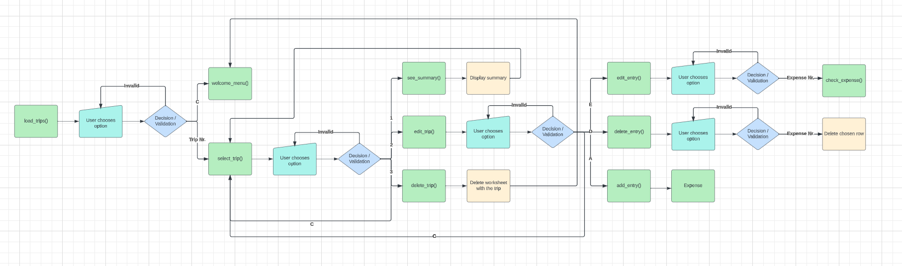
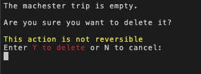
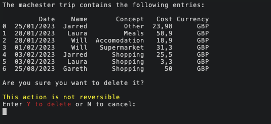
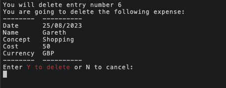

# Trip Split

Trip Split is an application to track trip expenses.

It enables users to seamlessly add, edit, or remove trips and their costs. Additionally, they can gain valuable insights into individual expenditures.

[View the live site here](https://trip-split-b5b1f0cae200.herokuapp.com/)

## Table of Contents

* [User Goals](#user-goals)
* [Design](#design)
* [Features](#features)
* [Technologies Used](#technologies-used)
* [Testing](#testing)
* [Deployment](#deployment)
* [Credits](#credits)

## Goals

* Provide an application to track expenses, escpecially for groups.
* It should be intuitive, providing enough information so that the user knows what to do in each step.
* Should give the option, whenever it is possible, to move back to a previous step.
* Should give the option to make changes if a mistake is noticed.
* It needs to provide relevant feedback to the user when there is not enough information or a invalid data is provided.
* It needs to calculate the total cost of the trip in the user's selected currency, as well as the amount each user has overpaid or underpaid.

### User Stories

* As a user, I want to:
  1. Create a new trip to track expenses.
  2. Have several people adding their expenses to the trip.
  3. Have a currency conversion system to my preferred currency.
  4. See the list of existing trips.
  5. Edit an entry if there was an error.
  6. Delete an entry if it was an error.
  7. Delete a trip if it was an error or is not any more needed.
  8. See how much each person has spent.

## Design

The application has been designed with the goal of having the users making one decision at a time and providing input for it on each step. Whenever possible, they should have the option to move back to the previous step.

### Flowcharts

Welcome

Create trip path

See trips path

### Structure

#### Welcome menu
* Displayed when the application is launched. The user will also have the possibility to return to this menu in several ways.
* Is shows a welcome message and a short explanation of what the user can do.
* Gives the user the possibility to choose between:
    * Create a new trip.
    * See a list of existing trips.

Welcome menu

#### Create new trip
* It takes the user to the trip creation flow:
    * First, the name of the trip must be provided.
    

Create new trip - Name

    
    

    * Then, the user currency must be provided.
    

Create new trip - Currency

    
    

    * After those two steps, the trip is created and the user can choose if they want to add an expense.
    

Create new trip - Add expense

    
    

#### See existing trips
* All trips that have been created are listed.
* The user can choose between one of them or go back to the welcome menu.

See existing trips

#### Trip menu
* The number of entries the trip contain are displayed.
* The user has the possibility to:
    * See the trip summary.
    * Edit the trip.
    * Delete the trip.
    * Go back to see the list of trips.

Trip menu - Without entries

Trip menu - With entries

#### Trip summary
It displays a summary of the trip. From here, the user can only go back to the trip menu.

Trip summary - Without entries

Trip summary - With entries

#### Edit trip
* It lists all trip entries.
* It gives the possibility to add, edit or delete trip entries. The user can also go back to the trip menu.

Edit trip - Without entries

Trip trip - With entries

#### Delete trip
* It lists all trip entries.
* Asks for confirmation to delete the trip. The user can either confirm the deletion or go back to the trip menu

Delete trip - Without entries

Delete trip - With entries

## Features

### User stories fullfillment

1 Create a new trip to track expenses.

    Steps:
    1. Start the programm or navigate back to the welcome menu.
    2. Enter '1' to create a new trip.
    3. Follow the instructions in the next steps:
        - Add a trip name.
        - Choose a currency.

2 Be able to have several people adding their expenses to the trip.

    Steps - Option 1:
    1. After finishing creating a trip, the user will be asked if they want to add an expense. Enter 'Y'
    2. Follow the instructions in each step to create the expense, part of the information to provide is the name of the person adding the expense.
        - Add a date.
        - Add the name of the person.
        - Add the concept.
        - Add the cost.
        - Add the currency.

    Steps - Option 2:
    1. In the welcome menu enter '2' to see the list of existing trips.
    2. Choose the trip for which the expense will be added.
    3. Select 'Edit trip'.
    4. Enter 'A' to add an entry and follow the same steps describe in Option 1.

Add expense - Date

Add expense - Name

Add expense - Concept

Add expense - Cost

Add expense - Currency

3 Have a currency conversion system to my preferred currency.

    Steps:
    1. When creating a new trip the user must choose the base currency to which all expenses will be converted to.
    2. When adding a new expense the user must choose the currency they used to pay.
    3. After selecting a trip (Welcome menu > See existing trips > Select trip), enter '1' to see the summary of the trip. The trip cost and cost per person displayed are converted to the currency chosen by the user when the trip was created.

4 See the existing entries of a trip.

    Steps
    1. In the welcome menu, enter '2' to see the list of existing trips.
    2. Enter the number of one of the existing trips.
    3. Select the 'Edit trip' option:
        - If there are no entries, there will be a message saying that the trip is empty.
        - If there are entries, they will be displayed.

5 Edit an entry if there was a mistake.

    Steps - Option 1, While creating the expense:
    1. Follow the steps as described in the User Story 2, entering 'E' instead of 'A'.
    2. Once information for all fields has been provided, a summary of the expense will be displayed.
    3. The user will have the option to edit any of the fields before it is saved:
        - In order to do that, the user must enter the name of the field they want to edit.
        - Then again the summary will be displayed and the user will continue to have the possibility to edit any field.
    4. When all fields have the correct information, the user can save it.

    Steps - Option 2, When the expense already exists:
    1. Follow the steps described in the User Story 4.
    2. Enter 'E'.
    3. Enter the number of the expense to be edited.
    4. The summary of the expense is displayed and it can then be edited in the same way as described in Option 1.

Edit expense

6 Delete an entry if it was a mistake

    Steps:
    1. In the welcome menu enter '2' to see the list of existing trips.
    2. Choose the trip for which the expense will be deleted.
    3. Select 'Edit trip'.
    4. Enter 'D' to delete an entry.
    5. Enter the number of the entry that will be deleted.
    6. Enter 'Y' to confirm.

Delete expense

7 Delete a trip if it was a mistake or is not any more needed.

    Steps:
    1. In the welcome menu enter '2' to see the list of existing trips.
    2. Choose the trip that will be deleted.
    3. Select 'Delete trip'.
    4. Enter 'D' to delete an entry.
    5. Enter 'Y' to confirm.

8 See how much each person has spent.

    Steps:
    1. In the welcome menu enter '2' to see the list of existing trips.
    2. Choose the relevant trip.
    3. Select 'See summary".
    4. The following information will be displayed:
        - The name of the trip.
        - The chosen base currency.
        - The total cost of the trip in the chosen currency.
        - A table with how much each person has spent, how much each person should have paid (total cost / nr. of people) and how much each person should pay (negative numbers) or receive (positive numbers)

### Additional features

#### Data storage

The programm uses a Google Spreadsheet to save and fetch trips data. The spreadsheet can be accessed [here](https://docs.google.com/spreadsheets/d/1bzdwem6NsTVaEm1tRZfcupDeK-qbkPKys-CPtTWXnxc/edit#gid=1855189207).

In order to convert the trip currencies to the base currencies chosen by the users, static currency exchanges have been added to the first worksheet.

Currency exchange

#### Data model

I've used an Expense class to create the expenses. I first doubted between a dictionary and a class, as I needed a data structure that would allow me to access a value based on a key. The reason I finally decided to use a class is that it would allow me to implement methods to convert the trip currencies to the base currency.

#### Input validation

For each decision users have to make, where input is needed, a validation system has been implemented to make sure users always choose only one of the valid options. For more details see the [Testing](#testing) section.

### Future features

* Users should only be able to see their trips. At the moment only one spreadsheet exists where all trips are stored.
* Add more currencies and a system to dynamically update exchange rates.
* At the moment once the trip currency is set it can't be edited. Add function for users to be able to edit it.
* Add more options to the "See summary" menu. For instance see cost by concept and display charts.

## Technologies Used

### Languages

* Python

### Python libraries and modules

* `gspread` was used for access and manipulation of Google Spreadsheets.
* `google.oauth2.service_account` was used to handle credentials between the application and Google Sheets.
* `os` was used to clear the terminal.
* `datetime` was used to make sure users enter valid dates.
* `time` was used to delay certain actions, as a way to give users a bit more time to better understand what happens.
* `pandas` was used to create dataframes with the data in the spreadsheet. It makes easier to summarize data and do arithmetic operation.
* `colorama` was used to give users visual feedback using colors.
* `pyfiglet` was used to create the ASCII Art for the welcome message.
* `warnings` was used to avoid deprecation warning messages in the terminal.

### Other framewoks and tools
* `CodeAnywhere` was the IDE used to develop the application.
* `GitHub` is used to host the code.
* `Git` was userd for version control.
* `Lucidchart` was used to create the flow charts.
* `Heroku` was used to deploy the project.

## Testing

### Python Linter

I ran all Python code through [CI Python Linter](https://pep8ci.herokuapp.com/). During development, most warnings were caused by excessively long lines, prompting me to modify them. Additionally, I received warnings due to the style I used for the ASCII welcome message, what led me to replace for the one created with the `pyfiglet` module.
Eventually, all the code passed validation without any issues.

CI Python Linter

### Manual Testing

#### Welcome menu

| Situation | Expected Outcome | Outcome |
|-----------|------------------|---------|
| User enters a number other than 1 or 2. | Get the message "Invalid choice: You entered {user_input}".  Then the user is prompted to enter one of the options again. | Works as expected. |
| User enters something different than a number. | Get the message "Invalid choice: invalid literal for int() with base 10: {user_input}"  Then the user is prompted to enter one of the options again. | Works as expected. |
| User enters 1. | Trip creating process starts, where user is asked to enter the name of the trip. | Works as expected. |
| User enters 2, when there are saved trips. | The list of exisiting trips is displayed. | Works as expected. |
| User enters 2, but there are currently no saved trips. | The message "There are currently no trips" is displayed and the user is taken back to the Welcome menu. | Works as expected. |

#### Create new trip menu

| Situation | Expected Outcome | Outcome |
|-----------|------------------|---------|
| User enters a name for a trip that already exists. | The message "The {trip_name} trip already exists. Please select a different name." is displayed. | Works as expected. |
| User enters a name but then enters "C" (or "c") in the select currency menu. | The message "The trip creation process has been aborted" is displayed and the user is taken back to the Welcome menu, without creating the trip. | Works as expected. |
| User enters a name but in the select currency menu selects a number different than 1, 2, or 3. | Get the message "Invalid choice: You entered {user_input}".  Then the user is prompted to enter one of the options again. | Works as expected. |
| User enters a name but in the select currency menu selects something different than a number or "C". | Get the message "Invalid choice: invalid literal for int() with base 10: {user_input}"  Then the user is prompted to enter one of the options again. | Works as expected. |
| User enters a name a selects a valid currency. | The trip is created and a new worksheet with the trip name as title is created. Then the user is asked if they want to add an expense. | Works as expected.
| Users are asked if they want to create an expense right after creating a trip, and answer anything other than "Y" (or "y") or "N" (or "n"). | It clears the terminal and asks again. | Works as expected. |
| Users are asked if they want to create an expense right after creating a trip, and answer "N" (or "n"). | It clears the terminal and loads the trip menu. | Works as expected. |
| Users are asked if they want to create an expense right after creating a trip, and answer "Y" (or "y"). | It clears the terminal start the expense creation process. | Works as expected. |

#### Add expense flow

A user can end up in this flow if they decide to create an expense right after creating a trip or when the want to add an expense to an exisiting trip. It will also partially apply when the user wants to edit a existing entry.

*Date*
| Situation | Expected Outcome | Outcome |
|-----------|------------------|---------|
| User is requested to enter a date in dd/mm/yyyy format or C to cancel and enters in a different format. | The message "The date entered is not valid, please try again." will be displayed and the user will be asked again. | Works as expected. |
| User is requested to enter a date in dd/mm/yyyy format or C to cancel and enters a non existing date (eg. 30/02/2023). | The message "The date entered is not valid, please try again." will be displayed and the user will be asked again. | Works as expected. |
| User is requested to enter a date in dd/mm/yyyy format or C to cancel and enters C. | The user is taken to the trip menu. | Works as expected. |
| User is requested to enter a date in dd/mm/yyyy format or C to cancel and enters a valid date. | The user will move on to the screen, asking for the name. | Works as expected. |

*Name*
| Situation | Expected Outcome | Outcome |
|-----------|------------------|---------|
| User is requested to enter the name of the person paying and enters a name. | The user will move on to the screen, asking for the concept of the expense. | Works as expected. |

*Concept*
| Situation | Expected Outcome | Outcome |
|-----------|------------------|---------|
| User is requested to enter the number of the concept (1, 2, 3, 4, 5, 6) or "C" (or "c") to cancel. The user enters a different number. | Get the message "Invalid choice: You entered {user_input}".  Then the user is prompted to enter one of the options again. | Works as expected. |
| User is requested to enter the number of the concept (1, 2, 3, 4, 5, 6) or "C" (or "c") to cancel. The user enters something different than a number or C. | Get the message "Invalid choice: invalid literal for int() with base 10: {user_input}"  Then the user is prompted to enter one of the options again. | Works as expected. |
| User is requested to enter the number of the concept (1, 2, 3, 4, 5, 6) or "C" (or "c") to cancel. User enters C. | The user is taken to the trip menu. | Works as expected. |
| User is requested to enter the number of the concept (1, 2, 3, 4, 5, 6) or "C" (or "c") to cancel. User enters a number in the range. | The user moves on to the cost. | Works as expected. |

*Cost*
| Situation | Expected Outcome | Outcome |
|-----------|------------------|---------|
| User is requested to enter the cost in the following format: 19.95 or "C" (or "c") to cancel. The user enters something different than number. | Get the message "{user_input} is not valid input, please try again.".  Then the user is prompted to enter the cost again. | Works as expected. |
| User is requested to enter the cost in the following format: 19.95 or "C" (or "c") to cancel. The user enters a decimal with "," instead of ".". | Get the message "{user_input} is not valid input, please try again.".  Then the user is prompted to enter the cost again. | Works as expected. |
| User is requested to enter the cost in the following format: 19.95 or "C" (or "c") to cancel. User enters C. | The user is taken to the trip menu. | Works as expected. |
| User is requested to enter the cost in the following format: 19.95 or "C" (or "c") to cancel. User enters a valid number. | The user moves on to the currency. | Works as expected. |

*Currency*
| Situation | Expected Outcome | Outcome |
|-----------|------------------|---------|
| User is requested to enter the number of the currency (1, 2, 3) or "C" (or "c") to cancel. The user enters a different number. | Get the message "Invalid choice: You entered {user_input}".  Then the user is prompted to enter one of the options again. | Works as expected. |
| User is requested to enter the number of the currency (1, 2, 3) or "C" (or "c") to cancel. The user enters something different than a number or C. | Get the message "Invalid choice: invalid literal for int() with base 10: {user_input}"  Then the user is prompted to enter one of the options again. | Works as expected. |
| User is requested to enter the number of the currency (1, 2, 3) or "C" (or "c") to cancel. User enters C. | The user is taken to the trip menu. | Works as expected. |
| User is requested to enter the number of the currency (1, 2, 3) or "C" (or "c") to cancel. User enters a number in the range. | The summary of the data is displayed. | Works as expected. |

*Record summary*
| Situation | Expected Outcome | Outcome |
|-----------|------------------|---------|
| When the summary is displayed, the user enters something different than the allowed options (name of the field to edit, "Y" or "C"). | The message "The value entered is not valid. Please try again." is displayed and the user is presented again with the same information. | Works as expected. |
| When the summary is displayed, the user enters the name of one of the fields. | The process for adding a field starts, as described above, and then the summary is displayed again. | Works as expected. |
| When the summary is displayed, the user enters C. | The process is cancelled and the user is taken to the trip menu. | Works as expected. |
| When the summary is displayed, the user enters Y. | The message "Expense added successfully!" is displayed and the row is added to the worksheet. The the user is asked if they want to add another expense. | Works as expected. |

#### See existing trips menu

| Situation | Expected Outcome | Outcome |
|-----------|------------------|---------|
| User enters a number different than the available options. | Get the message "Invalid choice: You entered {user_input}".  Then the user is prompted to enter one of the options again. | Works as expected. |
| User enters something different than a number or C. | Get the message "Invalid choice: invalid literal for int() with base 10: {user_input}"  Then the user is prompted to enter one of the options again. | Works as expected. |
| User enters C. | User is taken back to the Welcome menu. | Works as expected. |
| User enters one of the valid numbers. | The chosen trip menu is loaded, which will displayed the trip menu with the number of entries. | Works as expected. |

#### Selected trip menu

| Situation | Expected Outcome | Outcome |
|-----------|------------------|---------|
| User enters a number different than the available options. | Get the message "Invalid choice: You entered {user_input}".  Then the user is prompted to enter one of the options again. | Works as expected. |
| User enters something different than a number or C. | Get the message "Invalid choice: invalid literal for int() with base 10: {user_input}"  Then the user is prompted to enter one of the options again. | Works as expected. |
| User enters C. | User is taken back to the existing trips menu. | Works as expected. |
| User enters 1 (See summary). | The summary of the trip is displayed. . If the trip is empty there will be a message saying so and no calculations will be done.  If there are entries the summary will be displayed, converting the cost from the trip currency to the base currency. | Works as expected. |
| User enters 2 (Edit trip). | If there are entries, they will be displayed and the user will have the possibility to add, edit or delete entries. If there are no entries, a message will say so and the user will only be able to add entries. | Works as expected. |
| User enters 3 (Delete trip). | The entries (if any) of the trip will be displayed and the user will be asked for confirmation (entering "Y") to delete the trip. | Works as expected. |

#### Edit trip

| Situation | Expected Outcome | Outcome |
|-----------|------------------|---------|
| User enters anything different than "E", "D", "A", or "C". | The message "Invalid choice, please try again" is displayed  Then the user is prompted to enter one of the options again. | Works as expected. |
| User enters "C". | The user is taken back to the selected trip menu. | Works as expected.
| User enters "E" (if the trip has entries). | The user will be asked to enter then the number of the entry they want to edit. The process is the same as described above in "Record summary". | Works as expected.
| User enters "D" (if the trip has entries). | The user will be asked to enter then the number of the entry they want to delete. The summary of the expense will be displayed and the user will need to confirm (Entering "Y") the deletion. | Works as expected.
| User enters "A" | The "Add expense flow", as described above, starts. | Works as expected. |

### Bugs

| Bug | Fix |
|-----|-----|
| Creating a new trip with the same name as an existing trip caused an error. | Create a new condition that checks if the trip name (worksheet name) already exists. |
| After loading list of existing trips, entering 'C' wasn't accepted as valid input. | Add lower() method to the user's input. |
| Trying to do arithmetic operation with data from spreadsheet caused an error. | Add the replace() method to change ',' with '.' and convert the result to float. |
| Trying to see the summary of an empty trip caused an error. | Check first if the trip is empty before performing operations. If it's empty only display a message. |
| After deleting a trip, the deleted trip was still being displayed if the user chose to see existing trips right after deleting it, causing an error. | The variable storing the worksheets was in the global scope, so they weren't updated unless the user restarted the application. I moved the variable to the local scope of the functions that needed access to it. | 
| An empty trip (without header) could be created if the user aborted the trip creation process after entering the name of the trip and cancelled before selecting the base currency. This would result in errors when trying to select the trip later on. | Move the worksheet creation method call until after the user has provided all necessary information. And add exception handling to the get_currency function if the user canceled before entering the currency (because otherwise the load_trip function would try to load a non existing trip). |
| Trying to see the summary of a trip with only 1 entry caused an error. | I made a mistake assigning the index 1 instead of 0 of the dataframe to the `chosen_curr` varibale. I then replaced index 1 with 0. |

#### Mistakes

Especially in the beginning, I made some commits larger than they should have been and some messages were too lengthy. When I realized this, I tried to keep them smaller with more concise messages.

## Deployment

The project has been deployed using Heroku, following the below steps:
* Go to Heroku, once you have an account, click "Create new app".
* Choose an app name and a region and click "Create app".
* Go to "Settings" and click "Reveal Config Vars", adding two key-value pairs:
    * Key: Port, Value: 8000
    * Key: CREDS, Value: (credential from creds.json file)
* Then click "Add buildpack" and add "python" and "nodejs" (in this order).
* Finally, go back to the "Deploy" menu and there:
    * Select GitHub as "Deployment Method" and connect to the repository.
    * Go to "Manual Deploy", choose "main" and click "Deploy Branch".
* The application will now be deployey.

## Credits

* How to create tables using the tabulate module - [AskPython Guide](https://www.askpython.com/python-modules/tabulate-tables-in-python)
* How to use tabulate with dictionaries - [Tutorial by EyeHunts](https://tutorial.eyehunts.com/python/python-tabulate-dictionary-example-code/)
* How to work with dates with the datetime module - [Datacamp tutorial](https://www.datacamp.com/tutorial/converting-strings-datetime-objects)
* How to use time.sleep() - [GeeksforGeeks](https://www.geeksforgeeks.org/sleep-in-python/)
* Iterate over an Object's attributes - [bobbyhadz.com](https://bobbyhadz.com/blog/python-iterate-over-object-attributes)
* How to use enumerate function - [W3Schools](https://www.w3schools.com/python/ref_func_enumerate.asp)
* Working with pandas dataframes - [Pandas](https://pandas.pydata.org/docs/user_guide/10min.html)
* How to use the string replace method - [W3Schools](https://www.w3schools.com/python/ref_string_replace.asp)
* [gspread API reference](https://docs.gspread.org/en/v5.10.0/index.html)
* How to use the colorama module - [linuxhint](https://linuxhint.com/colorama-python/)
* How to use thr pyfiglet module - [GeeksforGeeks](https://www.geeksforgeeks.org/python-ascii-art-using-pyfiglet-module/)
* How to use the warnings module - [Python docs](https://docs.python.org/3/library/warnings.html)